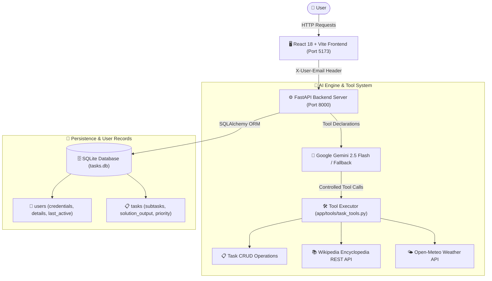
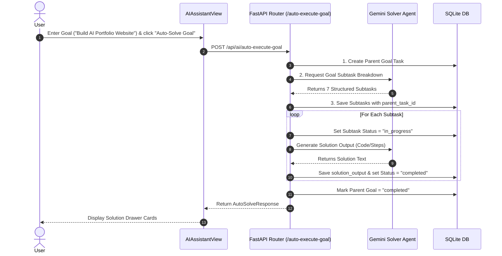

# 🕷️ Spidy Task Automation Assistant — Interactive User Manual

Welcome to the **Spidy Task Automation Assistant** official user manual. This platform provides an intelligent, AI-powered task management and automation workspace built with **FastAPI**, **SQLAlchemy**, **SQLite**, and **React 18 + Vite + Tailwind CSS**.

---

## 📐 System Architecture & Workflow

The platform links a visual interactive dashboard with a backend LLM tool-calling engine, specialized AI Agents, autonomous subtask solver workflows, and user credentials management.

---

## 🎨 Feature Walkthrough & Visual Guide

### 1. 📊 Interactive Dashboard & Task Management

The **Dashboard Overview** provides a visual snapshot of your daily task progress, urgency scoring, upcoming due dates, and completion metrics.

#### Key Functions:
- **Completion Progress Score**: Real-time progress bar calculated from completed vs. total tasks.
- **Urgent Tasks Spotlight**: Automatically highlights high-priority tasks with imminent deadlines.
- **Task Workspace**: Filter tasks by status (`pending`/`completed`), priority (`low`/`medium`/`high`), or category (`Work`, `Project`, `Study`, `General`).
- **Subtask Accordion**: Click on any parent task with subtasks to expand the subtask hierarchy.

---

### 2. 🤖 AI Natural Language Copilot Chat

Talk to your AI Assistant naturally to perform task operations, create reminders, or query your workspace.

#### Example Natural Language Prompts:
> 💬 *"Remind me to submit internship application tomorrow at 6 PM"*  
> 💬 *"Mark Python task complete"*  
> 💬 *"List all high priority tasks"*  
> 💬 *"Delete task ID 5"*

#### Tool Execution Badges:
When the LLM decides to execute an action, a glowing **Tool Execution Badge** appears displaying:
- **Tool Function**: `create_task()`, `update_task()`, `complete_task()`, `delete_task()`
- **Parsed Arguments**: Strict JSON arguments validated before execution.
- **Execution Status**: `SUCCESS` or `FAILED`.

---

### 3. 🌐 Free Public AI Agents

Spidy Task Automation Assistant includes specialized AI Agents connected to free public REST APIs:

#### 📚 Free Encyclopedia Knowledge Agent (`search_encyclopedia`)
- **API**: Wikipedia Summary REST API (`https://en.wikipedia.org/api/rest_v1/page/summary/`).
- **How to use**: Prompt *"Research Artificial Intelligence"* or *"Lookup Quantum Computing"*.
- **Result**: The agent queries Wikipedia and injects structured summaries directly into your chat context.

#### 🌤️ Free Weather Context Agent (`get_weather_info`)
- **API**: Open-Meteo Geocoding & Forecast API (`https://api.open-meteo.com/v1/forecast`).
- **How to use**: Prompt *"What is the weather in Tokyo?"* or *"Check weather forecast in London"*.
- **Result**: Returns current temperature (°C), windspeed, and weather conditions.

---

### 4. ⚙️ Autonomous AI Subtask Solver & Tracking Engine

Transform high-level goals into fully solved deliverable packages automatically.

#### Step-by-Step Instructions:
1. Open **AI Assistant** tab.
2. Under **AI Task Decomposition**, enter your goal (e.g. *"Build an AI-powered portfolio website"*).
3. Click **Auto-Solve Goal**.
4. The AI Agent breaks down the goal, invokes the solver for every subtask, attaches solution text/code blocks, and tracks execution to completion!

---

### 5. 🔑 User Email Identity, Custom Gemini Credentials & Analytics

Manage your personal email identity, configure custom Gemini API keys, and track your performance records.

#### Managing User Profile:
1. Click on the **User Email Badge** in the top header (or navigate to **Settings**).
2. Enter your **Email ID** (e.g., `student@example.com`). All tasks and AI analytics will be isolated under this email.
3. **Optional Custom Gemini API Key**: Enter your Google Gemini API Key (`AIzaSy...`) to use your personal quota. If left blank, the system automatically uses the backend default key.
4. View your **User Record & Analysis Profile**:
   - **Completion Score**: Percentage of completed vs total tasks.
   - **LLM Operations**: Total Gemini API requests invoked.
   - **Subtasks Solved**: Total subtasks completed by the AI solver agent.

---

### 6. 📊 AI Multi-Factor Priority Engine

Under **AI Assistant** -> **AI Priority Engine**:
1. Click **Analyze Task Priorities**.
2. The AI Priority Engine evaluates your active tasks against upcoming due dates, effort, subtask depth, and priority levels.
3. Generates a ranked list with score metrics (e.g. `10.5/10`) and rationale explanations.

---

## 🛠️ Quick Reference & Keyboard Commands

| Action | Navigation / Trigger | Endpoint |
|--------|----------------------|----------|
| **New Task** | Top Header `+ New Task` button | `POST /api/tasks` |
| **Switch User / Credentials** | Top Header Email Badge | `POST /api/users/login` |
| **Natural Language AI Chat** | AI Assistant -> Copilot Chat | `POST /api/ai/chat` |
| **Auto-Solve Goal** | AI Assistant -> Auto-Solve Goal | `POST /api/ai/auto-execute-goal` |
| **Analyze Task Priorities** | AI Assistant -> Priority Engine | `POST /api/ai/prioritize` |
| **Inspect System Health** | Settings Tab | `GET /health` |

---

*Spidy Task Automation Assistant — Intelligent, Safe, and Autonomous Task Execution.*
